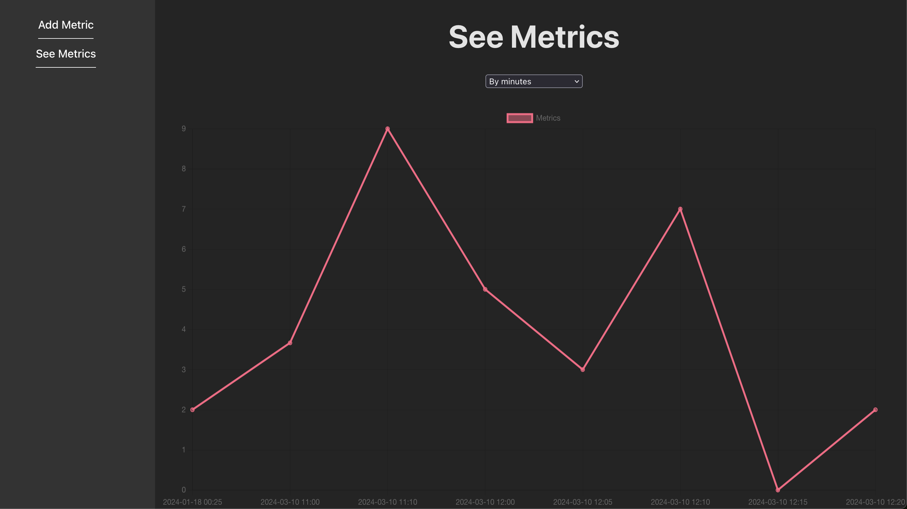
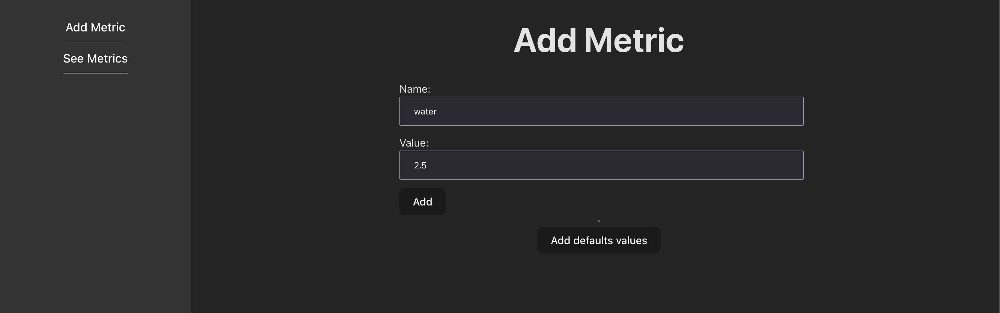
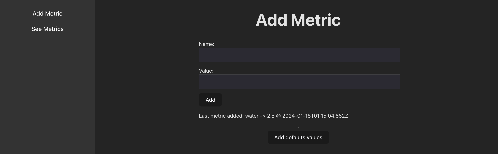
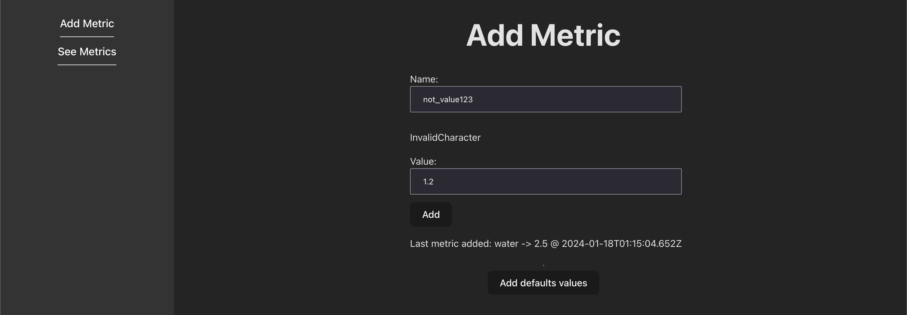
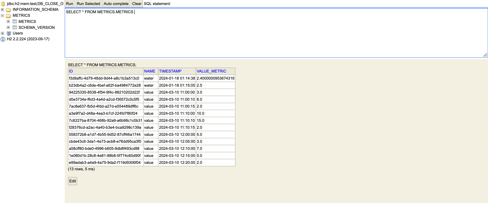

# Metric application for Factorial recruitment process.

Hi! I'm writing this README to help review the code of this application. I will try to go to the key points and hopefully
I will not extend myself a lot.

## Backend

The backend application is a Spring Boot 3 app written in Kotlin. The idea it is to have two public endpoints, one
to save a metric and another one two query the metrics from the system. However, I did a third one to help me 
do manual tests, as the third endpoint adds default values for metrics. Ideally, this endpoint would not be available
when the application would be developed in production (you could do that easily with spring profiles) but as I wanted
to go as fast as possible I didn't want to create several profiles for a sample app.

Let's go through some decisions I made to develop the app.

### Database

I used H2 database which is a in-memory relational database. The key point to use this database is because it is 
really easy to setup and I feel confident use it when testing locally my apps. However, if this is an app that I would
have to put into production I would never used H2 or any other relational database. The data-model for metric applications
fits a lot better with NOSQL databases as they are very data intensive and there is no real relation between the data
(there are no needs for JOINs). My ideal solution would have been to setup a docker image with a mongoDB or cassandra with it
and use it to save the metrics of the application.

### CQRS

I opted to organize the code following CQRS pattern. On the command side I applied a pure clean-architecture, even though
there are just a few value objects and one entity. But you could get an idea of how I like to organize the code following this pattern.
At this point you could see also my usage of the arrow library, which is a library that enhances the usage of functional programing 
in Kotlin. I mostly used it in this case to use the Either type and also be able to do an applicative validation of the data.
Going back to the organization of the clean architecture I follow this structure

* application: This is where the handlers of the application live. For me, a handler represents an use-case of the application
by handling a command, query or event. They are also called primary ports (ports-adapter architecture) as they transition
between the external-world (adapters) to our domain.
* domain: This is where the classes of our domain live. Inside of the domain you could find rich objects that represent the value-objects,entities,
aggregates, sagas, etc. This should be as pure as possible trying to avoid side-effects.
* infrastructure: Everything else goes into infrastructure. Here would be everything that we need to run our application. Primary and secondary adapters.

On the query side, I decided to have a different approach and use an ActiveRecord. Basically most of the logic on the query side
it's to extract the data as is requested and I left that part to do it in the database. So the only thing I had to do is to,
handle the query, select the correct grouping of data via a SQL query and return the same data as it was returned from the database.

One thing I would have liked to do it's to add in the query part a period-range. In a real-world application you shouldn't allow
users to query all your data on a single request. I would have added a from and a to period to query the metrics inside that 
time frame.

### Testing

I would have done a few more tests, but I think you can get an idea of my approach on testing. I missed to do a whole 
acceptance test to add and then retrieve via endpoints the metrics.

## Frontend

Sadly this part was much worse for me. I can tell you from the beginning that I barely have any skills on CSS so I struggled
to make it look *decent*. Also I didn't have time to add some testing, but even if I had, I struggle to with front testing.

I can't say much more about the frontend part. I like to use more hooks to avoid having so many logic on the page components. Also
in a more complex app, I would have added a lot more HoCs and decorate the page components with them. So far I could only think 
of doing a *withRepository* to add an HttpClient agnostic to fetch (so in case I would want to use something else, I would
not need to change the whole app)

I'm so sorry I didn't present a solution with a docker image so it would be easier for you to run the apps. I just 
had a hard time to even finish the assigment itself, so I will share a few screens so you can get an idea of how it looks:

